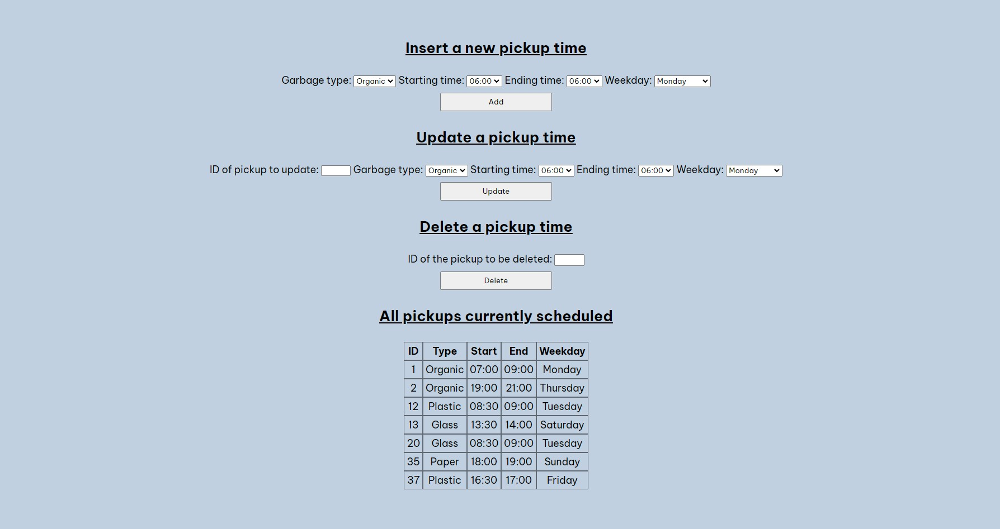

# Garbage

PHP application that connects to a MySQL database to keep track of garbage pick-up times.

It offers two paths to showcase how a simple client application would interact with the API provided. 

The API offers all the CRUD functions (Create, Read, Update, Delete).

## Built with:
The project uses:
- HTML & CSS
- JS
- PHP
- [Composer](https://getcomposer.org/) to autoload necessary classes
- [MySQL](https://www.mysql.com/) as the database

## How to use:
In order to use the application you need:
- PHP
- MySQL
- Composer

To get it up and running:
- Clone the project `git clone https://github.com/sbaglivi/garbage`
- Import the database: from the MySQL cli move into the migrations folder and then run `mysql -u {username} -p garbage < garbage.sql`
- update the helpers/config.php file to have the correct username / password credentials to connect to MySQL
- set up composer with `composer install`
- start the php web server with `php -S localhost:{portNumber}`
- Visit localhost:{portNumber}

Congratulations, you should have reached the index page! 

From here you can create a new pick-up time, update an existing one, delete one or just browse through the full list. 

There's another page (/search) that you can reach through the link in the top right and that will allow you to filter the current pick-up times by weekday, type or id.

Once the back-end is up and running you can create your own front-end application that uses the PHP API to serve the data through REST.
Have fun!

## Created by:
[Simone Baglivi](https:/github.com/sbaglivi)
